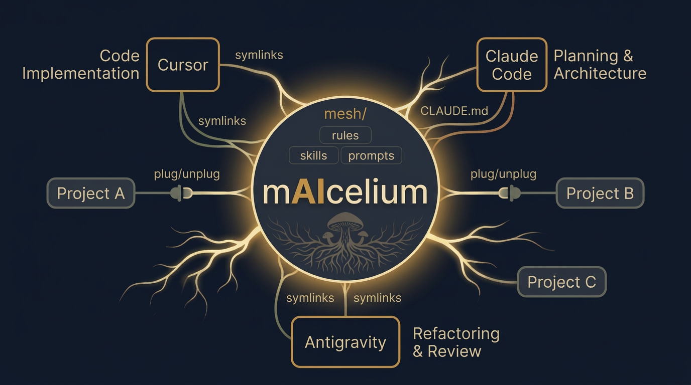
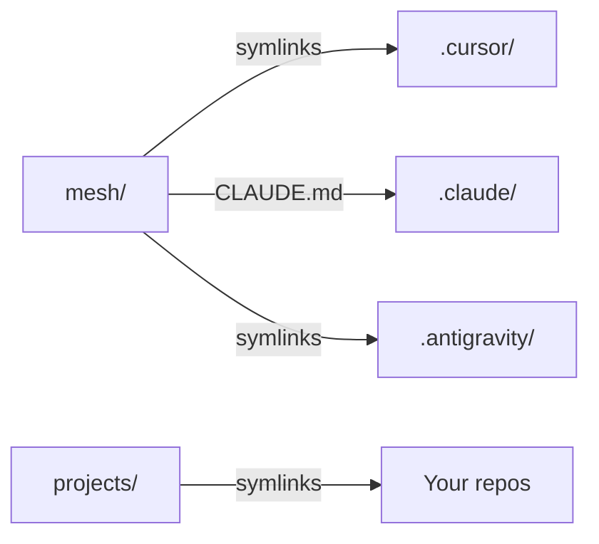

# mAIcelium

A centralized, multi-IDE workspace that connects AI coding agents to shared knowledge — like a fungal network feeding nutrients to every organism in the forest.

<p align="center">
  
</p>

## The problem

When you work with multiple AI-powered IDEs (Cursor, Claude Code, Antigravity), each one maintains its own rules, skills, and context in isolation. You end up duplicating configurations, losing consistency, and manually keeping things in sync.

## The solution

mAIcelium provides a single workspace directory where:

- **One source of truth** (`mesh/`) holds all rules, skills, prompts, and commands.
- **Symlinks** distribute that knowledge to each IDE in the format it expects.
- **Projects plug in and out** without copying files — just symlinks to your real repos.
- **Scripts automate everything** — no manual symlink management.



## Quick start

```bash
# 1. Clone the repository
git clone https://github.com/your-user/mAIcelium.git
cd mAIcelium

# 2. Initialize the workspace
bin/init.sh

# 3. Register your repos (edit with your actual paths)
cp repos/_registry.yaml.example repos/_registry.yaml
# edit repos/_registry.yaml

# 4. Plug in a project (from shell)
bin/add_project.sh my-api ~/dev/my-api
# or from inside an IDE with fuzzy matching:
#   /add_project my-api

# 5. Open this directory in your IDEs and start working
```

## Workspace structure

```
mAIcelium/
├── mesh/                        # Single source of truth for AI agents
│   ├── rules/                 # Global rules (coding standards, security, commits)
│   ├── skills/                # Reusable capabilities
│   │   ├── _common/           # Universal skills (code-review, planning, workspace-guide, etc.)
│   │   ├── _clients/          # Client-specific skills
│   │   └── _domains/          # Tech stack skills (React, Python, DevOps)
│   ├── commands/              # Agent command definitions
│   │   └── scripts/           # Python scripts for fuzzy-matched commands
│   └── prompts/               # Reusable prompt templates
├── bin/                       # Automation scripts
│   ├── init.sh                # Initialize the workspace
│   ├── add_project.sh         # Plug in a project
│   ├── remove_project.sh      # Unplug a project
│   ├── sync_symlinks.sh       # Rebuild all symlinks
│   └── separate_git.sh        # Separate .git from workspace (optional)
├── projects/                  # Symlinks to active repos
├── repos/                     # Repository registry
├── .cursor/                   # Auto-generated Cursor config (symlinks)
├── .claude/                   # Claude Code config + auto-generated context
├── .antigravity/              # Auto-generated Antigravity config (symlinks)
├── CLAUDE.md                  # Entry point for Claude Code agents
├── AGENTS.md                  # Agent permissions and coordination rules
├── WORKSPACE.md               # Dynamic state — active projects list
└── mAIcelium.code-workspace   # Auto-generated multi-root workspace (git-ignored)
```

## IDE responsibilities

| IDE | Role | How it connects |
|-----|------|----------------|
| **Cursor** | Code implementation | Symlinks in `.cursor/rules/` and `.cursor/skills-cursor/` |
| **Claude Code** | Planning, architecture, analysis | Reads `CLAUDE.md` → navigates to `mesh/` directly |
| **Antigravity** | Refactoring, review, scoped tasks | Symlinks in `.antigravity/` |

## Documentation

- **[Architecture](docs/architecture.md)** — How the system works, with diagrams
- **[Getting Started](docs/getting-started.md)** — Step-by-step walkthrough with examples
- **[Reference](docs/reference.md)** — Scripts, commands, rules, and skills reference

## Multi-root workspace (Source Control for injected projects)

By default, opening mAIcelium as a folder only shows its own git changes. To see **each injected project's Source Control** separately, use the auto-generated multi-root workspace:

1. Plug in your projects as usual (`bin/add_project.sh`)
2. Open Cursor/VSCode via **File → Open Workspace from File…** → select `mAIcelium.code-workspace`
3. Each project appears as a separate root with its own Source Control panel

The `.code-workspace` file is regenerated automatically by `add_project.sh`, `remove_project.sh`, and `sync_symlinks.sh`. It is git-ignored since its content depends on which projects each user has active.

## Key commands

### Shell scripts

| Command | Description |
|---------|-------------|
| `bin/init.sh` | Initialize a fresh workspace |
| `bin/add_project.sh <name> <path>` | Plug in a project |
| `bin/remove_project.sh <name>` | Unplug a project (original repo untouched) |
| `bin/sync_symlinks.sh` | Rebuild all symlinks after changes |
| `bin/separate_git.sh` | Move `.git` outside the workspace (avoids IDE git conflicts) |

### IDE slash commands (with fuzzy matching)

| Command | Description |
|---------|-------------|
| `/add_project <name>` | Fuzzy-match a project from the registry and plug it in |
| `/remove_project <name>` | Fuzzy-match a linked project and unplug it |
| `/list_projects` | Show all currently linked projects |
| `/workspace_status` | Full workspace status (projects, rules, skills, symlinks) |
| `/git_backup [message]` | Stage, commit, and push workspace changes |

Slash commands use Python scripts with **fuzzy matching** — you can type approximate names and the system will resolve them or ask for clarification.

## License

MIT

---

<sub>Cursor, Claude, and Antigravity are trademarks of their respective owners. This project is not affiliated with or endorsed by Anysphere, Anthropic, or Google.</sub>
