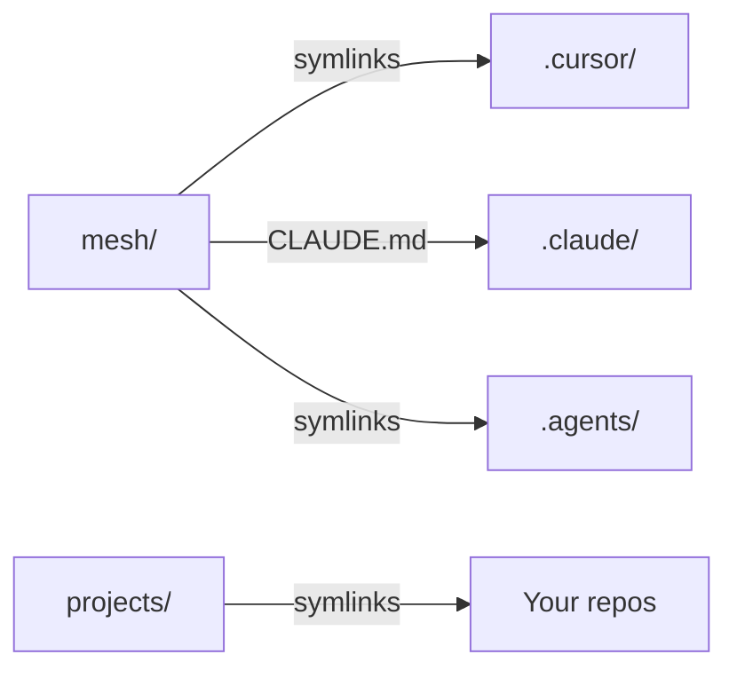

# mAIcelium

A centralized, multi-IDE workspace that connects AI coding agents to shared knowledge — like a fungal network feeding nutrients to every organism in the forest.

<p align="center">
  
</p>

## The problem

When you work with multiple AI-powered IDEs (Cursor, Claude Code, Antigravity), each one maintains its own rules, skills, and context in isolation. You end up duplicating configurations, losing consistency, and manually keeping things in sync.

## The solution

mAIcelium provides a single workspace directory where:

- **One source of truth** (`mesh/`) orchestrates all rules, skills, prompts, and commands, including optional layer repos mounted under `mesh/layers/`.
- **Symlinks** distribute that knowledge to each IDE in the format it expects.
- **Projects plug in and out** without copying files — just symlinks to your real repos.
- **Scripts automate everything** — no manual symlink management.


```mermaid
graph LR
    Mesh["mesh/"] -->|symlinks| Cursor[".cursor/"]
    Mesh -->|"CLAUDE.md"| Claude[".claude/"]
    Mesh -->|symlinks| Agents[".agents/"]
    Projects["projects/"] -->|symlinks| Repos["Your repos"]
```

## Quick start

```bash
# 1. Clone the repository
git clone https://github.com/your-user/mAIcelium.git
cd mAIcelium

# 2. (Recommended) Install the `mai` CLI — puts `mai` on your PATH
pip install -e .

# 3. Initialize the workspace
mai init
# zero-install alternative (no pip required): python3 bin/init.py

# 4. Register your repos (edit with your actual paths)
cp repos/_registry.yaml.example repos/_registry.yaml
# edit repos/_registry.yaml

# 5. Plug in a project
mai add my-api ~/dev/my-api
# zero-install alternative: python3 bin/add_project.py my-api ~/dev/my-api
# or from inside an IDE with fuzzy matching:
#   /add_project my-api

# 6. Sync the workspace
mai sync

# 7. Open this directory in your IDEs and start working
```

## Workspace structure

```
mAIcelium/
├── mesh/                        # Source-of-truth orchestrator for AI assets
│   ├── layers/                # Optional standalone layer repos (for reusable/client context)
│   │   └── core/              # Example: reusable domain rules + common/domain skills
│   ├── rules/                 # Framework rules + mounted domain rules
│   ├── skills/                # Framework skills + mounted reusable/domain skills
│   │   ├── _common/           # Universal skills (some may be symlink-mounted from layers)
│   │   ├── _clients/          # Client-specific skills
│   │   └── _domains/          # Tech stack skills (often symlink-mounted from layers)
│   ├── commands/              # Agent command definitions
│   │   └── scripts/           # Python scripts for fuzzy-matched commands
│   └── prompts/               # Reusable prompt templates
├── bin/                       # Automation scripts
│   ├── init.py                # Initialize the workspace
│   ├── add_project.py         # Plug in a project
│   ├── remove_project.py      # Unplug a project
│   ├── sync_symlinks.py       # Rebuild all symlinks
│   └── separate_git.py        # Separate .git from workspace (optional)
├── projects/                  # Symlinks to active repos
├── repos/                     # Repository registry
├── .cursor/                   # Auto-generated Cursor config (symlinks)
├── .claude/                   # Claude Code config + auto-generated context
├── .agents/                   # Auto-generated Antigravity config (symlinks)
├── CLAUDE.md                  # Entry point for Claude Code agents
├── AGENTS.md                  # Agent permissions and coordination rules
├── WORKSPACE.md               # Dynamic state — active projects list
└── mAIcelium.code-workspace   # Auto-generated multi-root workspace (git-ignored)
```

## IDE responsibilities

| IDE | Role | How it connects |
|-----|------|----------------|
| **Cursor** | Code implementation | Symlinks in `.cursor/rules/` and `.cursor/skills-cursor/` |
| **Claude Code** | Planning, architecture, analysis | Reads `CLAUDE.md` → navigates to `mesh/` directly |
| **Antigravity** | Refactoring, review, scoped tasks | Symlinks in `.agents/` (rules, skills, workflows, MCP) |

## Documentation

- **[Architecture](docs/architecture.md)** — How the system works, with diagrams
- **[Getting Started](docs/getting-started.md)** — Step-by-step walkthrough with examples
- **[Reference](docs/reference.md)** — Scripts, commands, rules, and skills reference

> Note: `mesh/` can include direct framework-owned content and symlink-mounted content from `mesh/layers/*`. If a path appears as a symlink in your IDE, that is expected behavior.

## Multi-root workspace (Source Control for injected projects)

By default, opening mAIcelium as a folder only shows its own git changes. To see **each injected project's Source Control** separately, use the auto-generated multi-root workspace:

1. Plug in your projects as usual (`python3 bin/add_project.py`)
2. Open Cursor/VSCode via **File → Open Workspace from File…** → select `mAIcelium.code-workspace`
3. Each project appears as a separate root with its own Source Control panel

The `.code-workspace` file is regenerated automatically by `add_project.py`, `remove_project.py`, and `sync_symlinks.py`. It is git-ignored since its content depends on which projects each user has active.

## Key commands

### The `mai` CLI

Install once with `pip install -e .` (editable; recommended) to get `mai` on your PATH. Alternatively, run the committed `./mai` shim (POSIX) or `mai.cmd` (Windows) directly from the checkout without any install step.

```bash
mai --help          # show all verbs
mai --version       # print version
mai <verb> --help   # verb-specific help (forwarded to the target script)
```

| Verb | Aliases | What it does |
|------|---------|--------------|
| `init` | — | Scaffold a new mAIcelium workspace |
| `add` | `add-project` | Add a project symlink |
| `remove` | `rm`, `remove-project` | Remove a project symlink |
| `sync` | `sync-symlinks` | Sync workspace symlinks (check/fix drift) |
| `separate-git` | `git-separate` | Separate a project's git history |
| `add-mcp` | `add-mcp-source` | Mount an external MCP definitions directory |
| `remove-mcp` | `remove-mcp-source` | Unmount the current MCP source |
| `add-layer` | `add-mesh-layer` | Add a mesh layer |
| `remove-layer` | `remove-mesh-layer` | Remove a mesh layer |
| `set-flag` | `set-project-flag` | Set a project flag |
| `list` | `ls`, `list-projects` | List all linked projects |
| `health` | `project-health` | Run health checks across all linked projects |

Global flags (must appear **before** the verb): `--root <path>`, `--version` / `-V`, `--help` / `-h`.

### Shell scripts (direct invocation, no install required)

| Command | Description |
|---------|-------------|
| `bin/init.py` | Initialize a fresh workspace |
| `bin/add_project.py <name> <path>` | Plug in a project |
| `bin/remove_project.py <name>` | Unplug a project (original repo untouched) |
| `bin/sync_symlinks.py` | Rebuild all symlinks after changes |
| `bin/separate_git.py` | Move `.git` outside the workspace (avoids IDE git conflicts) |

### IDE slash commands (with fuzzy matching)

| Command | Description |
|---------|-------------|
| `/add_project <name>` | Fuzzy-match a project from the registry and plug it in |
| `/remove_project <name>` | Fuzzy-match a linked project and unplug it |
| `/list_projects` | Show all currently linked projects |
| `/workspace_status` | Full workspace status (projects, rules, skills, symlinks) |
| `/project_health` | Diagnostic health check across all linked projects |
| `/git_backup [message]` | Stage, commit, and push workspace changes |

Slash commands use Python scripts with **fuzzy matching** — you can type approximate names and the system will resolve them or ask for clarification.

## License

MIT

---

<sub>Cursor, Claude, and Antigravity are trademarks of their respective owners. This project is not affiliated with or endorsed by Anysphere, Anthropic, or Google.</sub>
 