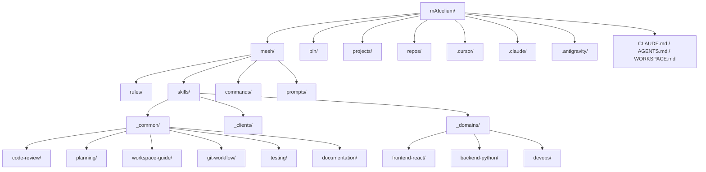
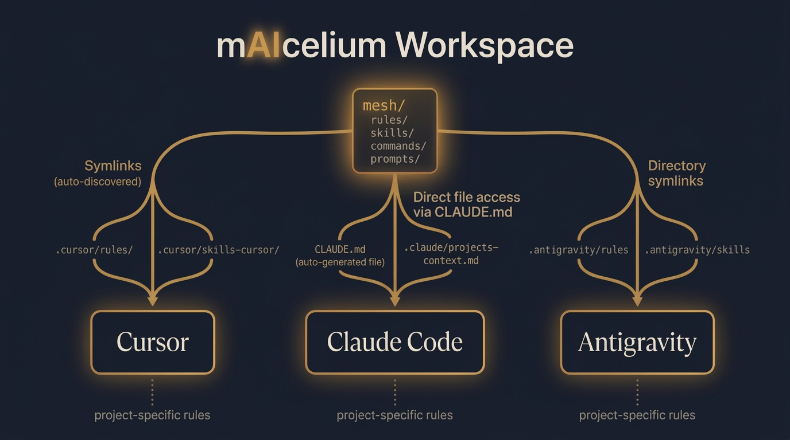
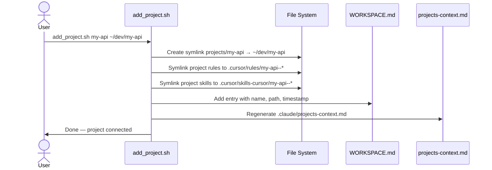
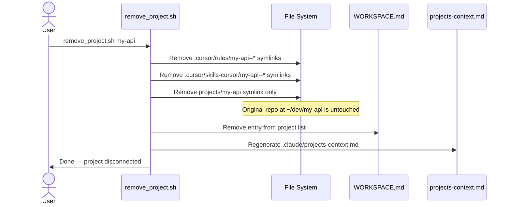
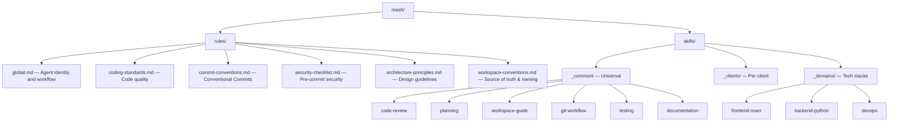

# Architecture

<p align="center">
  
</p>

## Overview

mAIcelium is a centralized workspace that lets multiple AI-powered IDEs share a single source of truth for rules, skills, prompts, and commands. Instead of duplicating configuration across `.cursor/`, `.claude/`, and `.antigravity/`, everything lives in one place — `mesh/` — and gets distributed to each IDE through the mechanism it understands.

The name is a play on "mycelium" — the underground fungal mesh that connects trees in a forest, allowing them to share nutrients and signals — with "AI" embedded in the word. Similarly, this workspace connects IDEs and projects through a shared AI knowledge layer.

## Core principles

1. **Single source of truth** — All AI agent knowledge lives in `mesh/`. No IDE-specific folder is the canonical source.
2. **Plug and unplug** — Projects connect via symlinks. The original repos are never modified or moved.
3. **IDE-agnostic knowledge** — Rules and skills are written once, consumed by all IDEs.
4. **Zero manual sync** — Scripts handle all symlink creation, cleanup, and context generation.
5. **Safe by design** — Scripts never run `rm -rf` on symlink targets. Only the symlink itself is removed.

## Directory structure



### What each directory does

| Directory | Purpose |
|-----------|---------|
| `mesh/rules/` | Global rules that every agent must follow: coding standards, commit conventions, security checklists, architecture principles. |
| `mesh/skills/` | Reusable capabilities. Each skill has a `SKILL.md` with instructions the agent reads before performing a task. |
| `mesh/commands/` | Agent command definitions (e.g., what happens when a user types `/add_project`). Includes `scripts/` with Python implementations for fuzzy matching. |
| `mesh/prompts/` | Reusable prompt templates with `{{placeholders}}` for common tasks (PR review, debugging, feature planning). |
| `bin/` | Bash scripts that automate workspace operations. |
| `projects/` | Symlinks to active repos. This is where agents work — they never touch files outside their project. |
| `repos/` | YAML registry of all available repos with paths, tech stacks, and metadata. |

## How each IDE discovers knowledge

<p align="center">
  
</p>

Each IDE has a different mechanism for discovering rules and skills. mAIcelium adapts to each one:

### Cursor

Cursor scans `.cursor/rules/` for rule files and `.cursor/skills-cursor/` for skill directories. mAIcelium creates **individual symlinks** for each rule and skill:

```
.cursor/rules/global.md            → ../../mesh/rules/global.md
.cursor/rules/coding-standards.md  → ../../mesh/rules/coding-standards.md
.cursor/skills-cursor/code-review  → ../../mesh/skills/_common/code-review
.cursor/skills-cursor/planning     → ../../mesh/skills/_common/planning
```

When a project is plugged in, its rules and skills are also symlinked with a prefix:

```
.cursor/rules/my-api--eslint-rules.mdc  → /home/user/dev/my-api/.cursor/rules/eslint-rules.mdc
.cursor/skills-cursor/my-api--testing   → /home/user/dev/my-api/.cursor/skills/testing/
```

### Claude Code

Claude Code reads `CLAUDE.md` at the workspace root, which tells it:

1. Where the rules are: `./mesh/rules/`
2. Where the skills are: `./mesh/skills/`
3. Where to find project-specific context: `.claude/projects-context.md`

The `projects-context.md` file is **auto-generated** by the scripts. It lists every active project's rules and skills so Claude Code knows to read them before working on that project.

### Antigravity

Antigravity uses **directory-level symlinks** — simpler than Cursor's per-file approach:

```
.antigravity/rules  → ../mesh/rules
.antigravity/skills → ../mesh/skills
```

## Project lifecycle

<p align="center">
  
</p>

### Plugging in a project

When you run `bin/add_project.sh my-api ~/dev/my-api`:



### Unplugging a project

When you run `bin/remove_project.sh my-api`:



### Syncing symlinks

`bin/sync_symlinks.sh` is the "rebuild everything" command. Use it when:

- You've manually edited `mesh/` (added rules or skills)
- Symlinks are broken (e.g., after moving the workspace)
- You want to ensure everything is consistent

It performs a full cleanup and recreation cycle for all three IDEs.

## Rules and skills taxonomy



### How rules work

Rules are markdown files in `mesh/rules/`. Every agent reads `global.md` before any task. Other rules are applied contextually — `security-checklist.md` before commits, `coding-standards.md` when writing code, etc.

Rules are **prescriptive** — they tell the agent what it must do or avoid.

### How skills work

Skills are directories with a `SKILL.md` that the agent reads before performing a specific type of task. Skills are **instructional** — they teach the agent how to do something.

A skill directory can also contain reference files, templates, and examples:

```
mesh/skills/_common/code-review/
└── SKILL.md         # Instructions for performing code reviews
```

### Skill categories

- **`_common/`** — Skills that apply to any project regardless of tech stack.
- **`_clients/`** — Skills specific to a particular client or engagement.
- **`_domains/`** — Skills tied to a technology (React, Python, DevOps, etc.).

## Auto-generated files

Two files in the workspace are generated by scripts and should never be edited manually:

| File | Generated by | Purpose |
|------|-------------|---------|
| `WORKSPACE.md` | `add_project.sh` / `remove_project.sh` | Lists active projects with paths and timestamps |
| `.claude/projects-context.md` | `_lib.sh` → `_regenerate_claude_context()` | Lists rules and skills of active projects for Claude Code |

## Fuzzy matching

Slash commands (`/add_project`, `/remove_project`) use Python scripts in `mesh/commands/scripts/` with a fuzzy matching module (`fuzzy.py`). The matching strategy works in priority order:

1. **Exact normalized match** — ignores case, hyphens, underscores, spaces.
2. **Substring containment** — if one candidate contains the input (or vice versa) and it's unambiguous.
3. **Bigram similarity** — Jaccard index over character bigrams, with a 0.4 threshold and 0.15 disambiguation margin.

When the input is ambiguous, the command returns candidates and asks the agent (who then asks the user) to clarify.

## Git separation

By default, the workspace has its own `.git` directory. When multiple projects are linked, this can cause IDE confusion — some IDEs detect git context from the workspace root instead of the linked project's repository.

`bin/separate_git.sh` moves `.git` to a sibling directory (`<workspace>-git-backup/.git`) and creates a shell alias:

```bash
alias maicelium-git='git --git-dir=.../mAIcelium-git-backup/.git --work-tree=.../mAIcelium'
```

The `/git_backup` agent command supports both modes (normal and separated) automatically.

## Security model

- **PreToolUse hooks (claude):** The workspace implements mechanical protection before actions execute:
  - `bin/hooks/guard-bash.sh` blocks destructive bash commands (e.g., `rm -rf /`, `git push --force`).
  - `bin/hooks/guard-write.sh` protects sensitive and auto-generated files (e.g., `WORKSPACE.md`, `.env`, lockfiles).
- Agents can **only write** inside `projects/<active-project>/` and `mesh/` (for new rules, skills, commands, prompts).
- Agents must **never modify** `.cursor/`, `.claude/`, or `.antigravity/` — these are auto-generated.
- Scripts **never run** `rm -rf` on symlink targets — only the symlink is removed.
- `.claude/settings.json` defines allowed bash operations including `python3 mesh/commands/scripts/*` and wires the protection hooks.
- The `.gitignore` excludes `projects/` (contains user-specific symlinks), `WORKSPACE.md` (dynamic state), `repos/_registry.yaml` (contains local paths), `.claude/projects-context.md` (auto-generated), and `bin/.git-alias.sh` (contains local paths).

## Multi-agent coordination

When multiple agents (from different IDEs) work on the same project simultaneously, conflicts are resolved at the git level — as if they were two human developers. Each agent makes atomic, descriptive commits following the [commit conventions](reference.md#commit-conventions).
