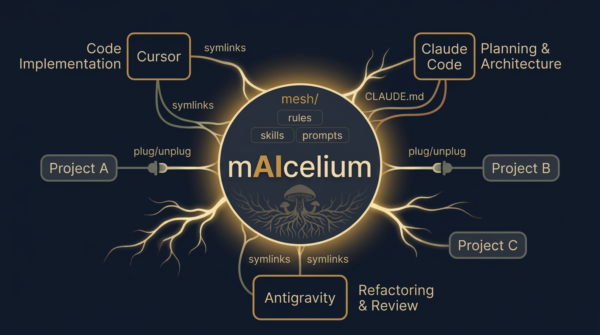
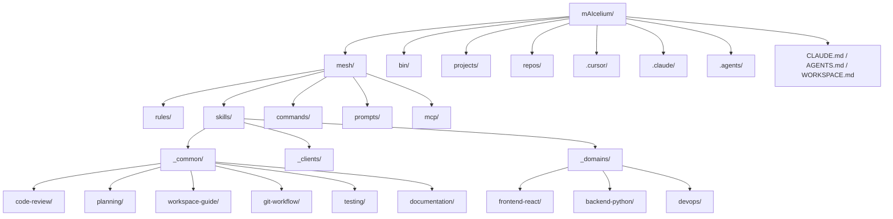
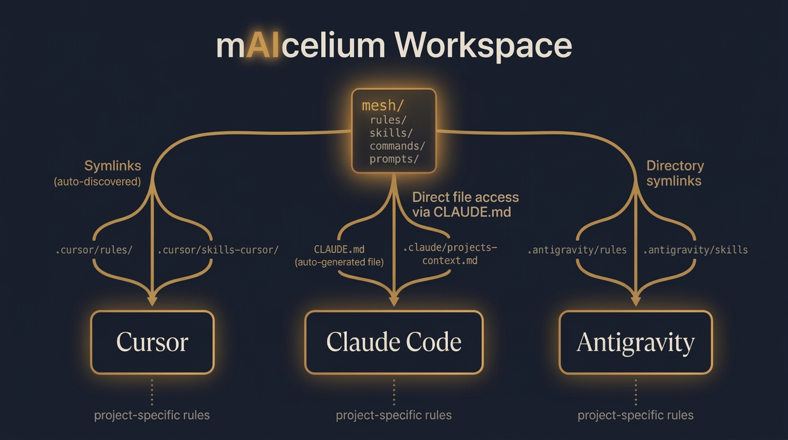
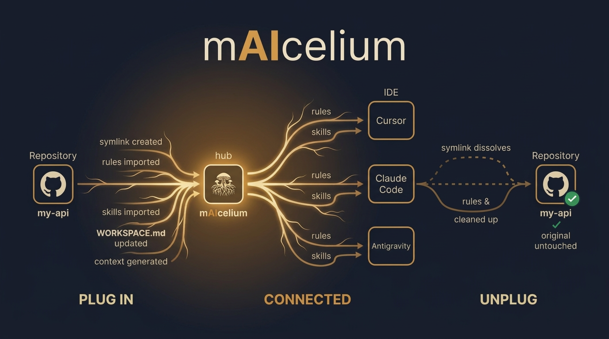
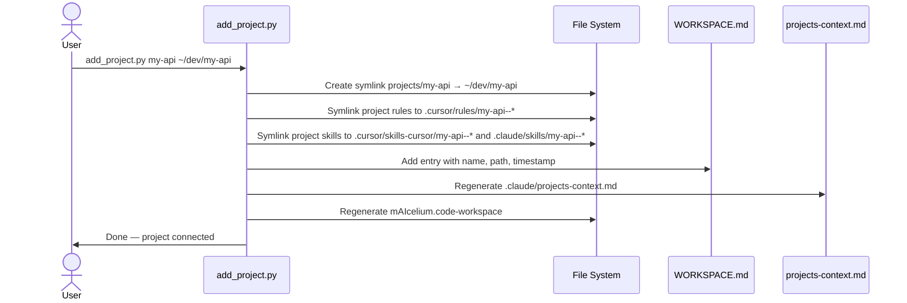
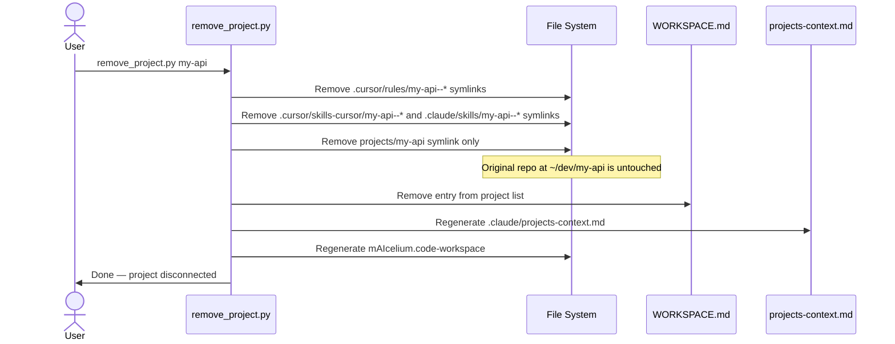
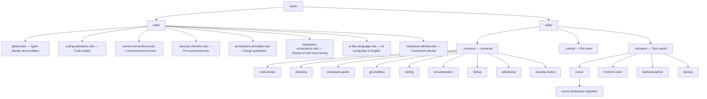

# Architecture

<p align="center">
  
</p>

## Overview

mAIcelium is a centralized workspace that lets multiple AI-powered IDEs share a single source of truth for rules, skills, prompts, and commands. Instead of duplicating configuration across `.cursor/`, `.claude/`, and `.agents/`, everything lives in one place — `mesh/` — and gets distributed to each IDE through the mechanism it understands.

The name is a play on "mycelium" — the underground fungal mesh that connects trees in a forest, allowing them to share nutrients and signals — with "AI" embedded in the word. Similarly, this workspace connects IDEs and projects through a shared AI knowledge layer.

## Core principles

1. **Single source of truth** — All AI agent knowledge lives in `mesh/` (or mesh layer repos). No IDE-specific folder is the canonical source.
2. **Plug and unplug** — Projects connect via symlinks. The original repos are never modified or moved.
3. **IDE-agnostic knowledge** — Rules and skills are written once, consumed by all IDEs.
4. **Zero manual sync** — Scripts handle all symlink creation, cleanup, and context generation.
5. **Safe by design** — Scripts never run `rm -rf` on symlink targets. Only the symlink itself is removed.
6. **Composable mesh** — Context-specific rules and skills live in isolated mesh layer repos. Each layer is a standalone git repo that the workspace assembles at sync time.

## Directory structure


```mermaid
graph TD
    Root["mAIcelium/"] --> Mesh["mesh/"]
    Root --> Bin["bin/"]
    Root --> Projects["projects/"]
    Root --> Repos["repos/"]
    Root --> CursorDir[".cursor/"]
    Root --> ClaudeDir[".claude/"]
    Root --> AgentsDir[".agents/"]
    Root --> ConfigFiles["CLAUDE.md / AGENTS.md / WORKSPACE.md"]

    Mesh --> Rules["rules/"]
    Mesh --> Skills["skills/"]
    Mesh --> Commands["commands/"]
    Mesh --> Prompts["prompts/"]
    Mesh --> MCP["mcp/"]

    Skills --> Common["_common/"]
    Skills --> Clients["_clients/"]
    Skills --> Domains["_domains/"]

    Common --> CodeReview["code-review/"]
    Common --> Planning["planning/"]
    Common --> WorkspaceGuide["workspace-guide/"]
    Common --> GitWorkflow["git-workflow/"]
    Common --> Testing["testing/"]
    Common --> Documentation["documentation/"]

    Domains --> FrontendReact["frontend-react/"]
    Domains --> BackendPython["backend-python/"]
    Domains --> DevOps["devops/"]
```

### What each directory does

| Directory | Purpose |
|-----------|---------|
| `mesh/rules/` | Rules (`.mdc` files with frontmatter) that agents must follow: coding standards, commit conventions, security checklists, architecture principles. Domain rules live in `_domains/`. |
| `mesh/skills/` | Reusable capabilities. Each skill has a `SKILL.md` with instructions the agent reads before performing a task. |
| `mesh/commands/` | Agent command definitions (e.g., what happens when a user types `/add_project`). Includes `scripts/` with Python implementations for fuzzy matching. |
| `mesh/prompts/` | Reusable prompt templates with `{{placeholders}}` for common tasks (PR review, debugging, feature planning). |
| `mesh/mcp/` | **Symlink** to an external MCP definitions directory registered in `WORKSPACE.md` under `mcp_source:`. Its `*.json` files are IDE-agnostic MCP server definitions. `sync_symlinks.py` merges them into `.mcp.json`, `.cursor/mcp.json`, and `.agents/mcp.json`. The external directory is pluggable via `bin/add_mcp_source.py` / `bin/remove_mcp_source.py` and is never tracked by this workspace's git. |
| `bin/` | Python scripts that automate workspace operations. |
| `projects/` | Symlinks to active repos. This is where agents work — they never touch files outside their project. |
| `repos/` | YAML registry of all available repos with paths, tech stacks, and metadata. |

## How each IDE discovers knowledge

<p align="center">
  
</p>

Each IDE has a different mechanism for discovering rules and skills. mAIcelium adapts to each one:

### Cursor

Cursor scans `.cursor/rules/` for rule files and `.cursor/skills-cursor/` for skill directories. mAIcelium creates **individual symlinks** for each rule and skill:

```
.cursor/rules/global.mdc            → ../../mesh/rules/global.mdc
.cursor/rules/coding-standards.mdc   → ../../mesh/rules/_domains/software/coding-standards.mdc
.cursor/skills-cursor/code-review    → ../../mesh/skills/_common/code-review
.cursor/skills-cursor/planning       → ../../mesh/skills/_common/planning
```

When a project is plugged in, its rules and skills are also symlinked with a prefix:

```
.cursor/rules/my-api--eslint-rules.mdc  → /home/user/dev/my-api/.cursor/rules/eslint-rules.mdc
.cursor/skills-cursor/my-api--testing   → /home/user/dev/my-api/.cursor/skills/testing/
```

### Claude Code

Claude Code consumes the mesh through two complementary channels.

**Skills — native discovery via symlinks.** Claude Code scans `.claude/skills/` for skill directories, exactly as Cursor scans `.cursor/skills-cursor/`. mAIcelium reflects the same flat namespace there:

```
.claude/skills/code-review          → ../../mesh/skills/_common/code-review
.claude/skills/devops--terraform    → ../../mesh/skills/_domains/devops/terraform-workflow
.claude/skills/tiber--jira-workflow → ../../mesh/skills/_clients/tiber/jira-workflow
.claude/skills/my-api--testing      → /home/user/dev/my-api/.cursor/skills/testing/
```

This is what makes a mesh skill *discoverable by description* in Claude Code — the agent gets the skill listed without having to browse `mesh/` by hand. The reflection is deliberately **workspace-local**: never `~/.claude/skills/`, which is the global personal scope and would leak workspace skills into every unrelated project on the machine, with absolute links that break the "all symlinks are relative" invariant.

**Rules — inlined into a generated context file.** Claude Code reads `CLAUDE.md` at the workspace root, which tells it:

1. Where the rules are: `./mesh/rules/`
2. Where the skills are: `./mesh/skills/` (canonical source; `.claude/skills/` is its reflection)
3. Where to find project-specific context: `.claude/projects-context.md`

The `projects-context.md` file is **auto-generated** by the scripts. It inlines every active project's rules in full, and lists its skills as an index rather than inlining their bodies — the skills are already loadable on demand through `.claude/skills/`, so inlining them too is the duplication that caused KI-001. A skill whose `SKILL.md` lacks the frontmatter Claude Code needs (`name` + `description`) cannot register natively, so those keep being inlined in full instead of silently disappearing.

### Antigravity

Antigravity uses `.agents/` with per-file symlinks for rules, flattened skills, workflows mapped from commands, and project data:

```
.agents/rules/global.mdc          → ../../mesh/rules/global.mdc
.agents/skills/planning            → ../../mesh/skills/_common/planning
.agents/skills/devops--terraform   → ../../../mesh/skills/_domains/devops/terraform-workflow
.agents/workflows/add_project.md   → ../../mesh/commands/add_project.md
.agents/projects/<name>/plans      → <repo>/.cursor/plans
.agents/mcp.json                   (generated from mesh/mcp/*.json)
```

Legacy `.antigravity/` directories are automatically removed by `sync_symlinks.py`.

## Project lifecycle

<p align="center">
  
</p>

### Plugging in a project

When you run `python3 bin/add_project.py my-api ~/dev/my-api`:


```mermaid
sequenceDiagram
    actor User
    participant Script as add_project.py
    participant FS as File System
    participant WS as WORKSPACE.md
    participant Claude as projects-context.md

    User->>Script: add_project.py my-api ~/dev/my-api
    Script->>FS: Create symlink projects/my-api → ~/dev/my-api
    Script->>FS: Symlink project rules to .cursor/rules/my-api--*
    Script->>FS: Symlink project skills to .cursor/skills-cursor/my-api--* and .claude/skills/my-api--*
    Script->>WS: Add entry with name, path, timestamp
    Script->>Claude: Regenerate .claude/projects-context.md
    Script->>FS: Regenerate mAIcelium.code-workspace
    Script->>User: Done — project connected
```

### Unplugging a project

When you run `python3 bin/remove_project.py my-api`:


```mermaid
sequenceDiagram
    actor User
    participant Script as remove_project.py
    participant FS as File System
    participant WS as WORKSPACE.md
    participant Claude as projects-context.md

    User->>Script: remove_project.py my-api
    Script->>FS: Remove .cursor/rules/my-api--* symlinks
    Script->>FS: Remove .cursor/skills-cursor/my-api--* and .claude/skills/my-api--* symlinks
    Script->>FS: Remove projects/my-api symlink only
    Note over FS: Original repo at ~/dev/my-api is untouched
    Script->>WS: Remove entry from project list
    Script->>Claude: Regenerate .claude/projects-context.md
    Script->>FS: Regenerate mAIcelium.code-workspace
    Script->>User: Done — project disconnected
```

### Syncing symlinks

`bin/sync_symlinks.py` is the "rebuild everything" command. Use it when:

- You've manually edited `mesh/` (added rules or skills)
- Symlinks are broken (e.g., after moving the workspace)
- You want to ensure everything is consistent

It performs a full cleanup and recreation cycle:

1. Cleans broken symlinks in `.cursor/rules/`, `.cursor/skills-cursor/`, `.claude/skills/` and `.agents/skills/`
2. Recreates global, domain, and client rule symlinks for Cursor and `.agents/`
3. Recreates skill symlinks for Cursor (per-category), `.claude/skills/` and `.agents/skills/` (both flattened)
4. Re-imports rules and skills from all currently plugged-in projects (project skills land in `.cursor/skills-cursor/` and `.claude/skills/`)
5. Maps commands to `.agents/workflows/` and project data to `.agents/projects/`
6. Mounts `mesh/mcp/` as a symlink to the directory registered under `mcp_source:` in `WORKSPACE.md` (or unmounts it when no source is registered), then generates MCP configs from `mesh/mcp/*.json` for all three IDEs
7. Regenerates `.claude/projects-context.md`
8. Regenerates `mAIcelium.code-workspace`
9. Removes legacy `.antigravity/` if present

## The `mai` CLI (command router)

`maicelium_cli.py` (repo root) is a thin router exposed as the `mai` console
script (`pip install -e .`) plus committed `mai` / `mai.cmd` shims for zero-install
use. It maps friendly verbs to the real scripts and dispatches via **subprocess**
(`sys.executable <script>`), never importing them — so each script keeps its own
argument parsing, encoding handling and exit code, which `mai` passes through
verbatim. Everything after the verb is forwarded untouched; only `--root`,
`--version` and `--help` are consumed before the verb.

The workspace root is resolved in order: `--root` → `MAICELIUM_ROOT` → upward
search for a directory containing `bin/_bootstrap.py` + `mesh/` (nearest ancestor)
→ the `maicelium_cli.py` directory. The resolved root is exported as
`MAICELIUM_ROOT` to the child so every downstream resolver agrees. If no workspace
can be located, `mai` exits 2 with an actionable message. See `docs/reference.md`
for the full verb table.

## Rules and skills taxonomy


```mermaid
graph TD
    Mesh["mesh/"] --> RulesDir["rules/"]
    Mesh --> SkillsDir["skills/"]

    RulesDir --> Global["global.mdc — Agent identity and workflow"]
    RulesDir --> Coding["coding-standards.mdc — Code quality"]
    RulesDir --> Commits["commit-conventions.mdc — Conventional Commits"]
    RulesDir --> Security["security-checklist.mdc — Pre-commit security"]
    RulesDir --> Architecture["architecture-principles.mdc — Design guidelines"]
    RulesDir --> WsConventions["workspace-conventions.mdc — Source of truth and naming"]
    RulesDir --> AiLang["ai-files-language.mdc — AI config files in English"]
    RulesDir --> Identity["maicelium-identity.mdc — Framework identity"]

    SkillsDir --> CommonDir["_common/ — Universal"]
    SkillsDir --> ClientsDir["_clients/ — Per-client"]
    SkillsDir --> DomainsDir["_domains/ — Tech stacks"]

    CommonDir --> CR["code-review"]
    CommonDir --> PL["planning"]
    CommonDir --> WG["workspace-guide"]
    CommonDir --> GW["git-workflow"]
    CommonDir --> TE["testing"]
    CommonDir --> DO["documentation"]
    CommonDir --> DB["debug"]
    CommonDir --> RF["refactoring"]
    CommonDir --> SR["security-review"]
    DomainsDir --> CU["cursor"]
    CU --> CW["cursor-workspace-migration"]

    DomainsDir --> FR["frontend-react"]
    DomainsDir --> BP["backend-python"]
    DomainsDir --> DV["devops"]
```

### How rules work

Rules are `.mdc` files (markdown with frontmatter) in `mesh/rules/`. Rules with `alwaysApply: true` in their frontmatter are injected automatically into every agent context. Domain-specific rules live in `mesh/rules/_domains/` (e.g., `software/coding-standards.mdc`).

Rules are **prescriptive** — they tell the agent what it must do or avoid.

### How skills work

Skills are directories with a `SKILL.md` that the agent reads before performing a specific type of task. Skills are **instructional** — they teach the agent how to do something.

A skill directory can also contain reference files, templates, and examples:

```
mesh/skills/_common/code-review/
└── SKILL.md         # Instructions for performing code reviews
```

### Skill categories

- **`_common/`** — Skills that apply to any project regardless of tech stack.
- **`_clients/`** — Skills specific to a particular client or engagement.
- **`_domains/`** — Skills tied to a technology (React, Python, DevOps, etc.).

## Mesh layers

The built-in `mesh/` directory contains rules and skills that apply universally (global rules, domain rules, common skills). For context-specific knowledge — such as rules and skills tied to a particular engagement, domain, or organizational scope — you can use **mesh layers**: external git repos that the workspace assembles alongside the built-in mesh.

### Layer structure and routing convention

A mesh layer is a plain git repo with `rules/` and/or `skills/` directories. Inside each, two folder names are **reserved** and trigger shared routing; everything else is treated as client-scoped content.

```
mesh-<name>/
├── skills/
│   ├── _common/                      # ← reserved: universal skills
│   │   └── <skill>/SKILL.md
│   ├── _domains/                     # ← reserved: tech-stack skills
│   │   ├── <domain>/SKILL.md         #    flat domain (the folder is the skill)
│   │   └── <domain>/<sub>/SKILL.md   #    nested domain (each child is a skill)
│   └── <skill>/                      # ← anything else: client-scoped
│       └── SKILL.md
└── rules/
    ├── _domains/                     # ← reserved: tech-stack rules
    │   └── <domain>/<rule>.mdc
    └── <rule>.mdc                    # ← anything else: client-scoped
```

`sync_symlinks.py` walks each registered layer and reflects its content into `mesh/` using this exact mapping:

| Path inside the layer                          | Reflected into                                            |
|------------------------------------------------|-----------------------------------------------------------|
| `skills/_common/<sk>/`                         | `mesh/skills/_common/<sk>/`                               |
| `skills/_domains/<sk>/`                        | `mesh/skills/_domains/<sk>/`                              |
| `skills/<other>/` (any folder name not above)  | `mesh/skills/_clients/<client>/<other>/`                  |
| `rules/_domains/<domain>/<r>.mdc`              | `mesh/rules/_domains/<domain>/<r>.mdc`                    |
| `rules/<r>.mdc` (flat at the layer root)       | `mesh/rules/_clients/<client>/<r>.mdc`                    |

The only "magic" tokens are `_common` and `_domains`. Anything that does not match those falls back to the client bucket. There is no metadata inside the layer to declare a different intent — classification is purely structural.

A single layer can mix all three buckets: `core` does (it carries `_common` and `_domains` only), `tiber` does (it carries only flat client content). A future layer could mix `_common`, `_domains`, and flat client folders simultaneously.

### WORKSPACE.md

Layers are declared in the `mesh_layers:` section of `WORKSPACE.md`. **A layer must be both physically present under `mesh/layers/<name>/` (or any path) and registered here. Without an entry, `sync_symlinks.py` ignores the layer entirely.**

```yaml
mesh_layers:
- name: my-layer
  path: ~/Dev/mesh-my-layer
  client: my-layer        # bucket name for flat content (defaults to <name>)
  repo: https://github.com/org/mesh-my-layer  # optional, for documentation
```

`name` identifies the layer. `client` is the namespace used for `_clients/<client>/` reflections; if omitted, it defaults to `name`. `path` may be absolute or relative to the workspace root.

### Adding a layer

```bash
python3 bin/add_mesh_layer.py <name> <path> [--client <prefix>] [--repo <url>]
```

This registers the layer in `WORKSPACE.md` and runs `sync_symlinks.py` to link its content into all IDEs.

### Removing a layer

```bash
python3 bin/remove_mesh_layer.py <name>
```

Removes all `client--*` symlinks from `.cursor/` and `.agents/`, cleans the `WORKSPACE.md` entry, and regenerates the Claude Code context. The layer repo on disk is left untouched.

### Setting up on a new machine

Clone the workspace, then clone each layer repo into `mesh/layers/` and register it:

```bash
git clone git@github.com:your-org/maicelium ~/Dev/mAIcelium
cd ~/Dev/mAIcelium

# Clone each layer into mesh/layers/
git clone git@github.com:your-org/mesh-acme mesh/layers/acme

# Register and sync
python3 bin/add_mesh_layer.py acme mesh/layers/acme --client acme
```

`mesh/layers/` is gitignored — each layer is a standalone repo cloned independently.

### How layers are assembled

At sync time, `sync_symlinks.py`:
- Links `<layer>/rules/*.mdc` → `.cursor/rules/<client>--*.mdc` and `.agents/rules/<client>--*.mdc`
- Links `<layer>/skills/*/` → `.cursor/skills-cursor/<client>--*/` and `.agents/skills/<client>--*/`
- Includes layer content in `.claude/projects-context.md` for any project whose name matches the layer's `client`

### Core layer — externalizing common and domain content

The `_common` skills and `_domains` rules/skills that ship with `mesh/` can also be moved to a standalone layer repo. This makes them independently versionable and swappable, just like any other layer.

When a layer holds content that mirrors the `mesh/` internal structure (`rules/_domains/`, `skills/_common/`, `skills/_domains/`), the simplest integration is to replace the corresponding directories in `mesh/` with symlinks pointing into the layer:

```
mesh/rules/_domains      → symlink → mesh/layers/core/rules/_domains/
mesh/skills/_common/<x>  → symlink → mesh/layers/core/skills/_common/<x>/
mesh/skills/_domains     → symlink → mesh/layers/core/skills/_domains/
```

`sync_symlinks.py` follows symlinks transparently, so no script changes are needed. The result is identical to having the content directly in `mesh/`.

What stays in `mesh/` regardless:

| Content | Why |
|---------|-----|
| `global.mdc`, `maicelium-identity.mdc`, `workspace-conventions.mdc` | Framework identity and workspace mechanics |
| `ai-files-language.mdc`, `commit-conventions.mdc` | Universal engineering conventions |
| `skills/workspace-guide` | Framework-specific onboarding |

### Separation of concerns

| Scope | Where it lives | Visibility |
|-------|---------------|------------|
| Framework identity and workspace mechanics | `mesh/` (this repo) | Public |
| Domain rules and common/domain skills | `mesh/layers/core/` (standalone repo) | Swappable |
| Context-specific rules/skills | `mesh/layers/<name>/` (separate repo) | As needed |

This keeps the workspace composable at every level: swap the core layer to change the baseline knowledge, add client layers for engagement-specific context.

## MCP source

MCP server definitions follow the same pluggable pattern as layers, but as a single singleton mount. The workspace does not ship any MCP `.json` files of its own — `mesh/mcp/` is a symlink to an external directory registered in `WORKSPACE.md`:

```yaml
mcp_source:
  path: /absolute/path/to/mcp-repo
  repo: git@github.com:org/mcp-repo.git   # optional, documentation only
```

### Lifecycle

```bash
# Mount an external MCP directory
python3 bin/add_mcp_source.py /path/to/external-mcp-repo [--repo <url>]

# Unmount (external directory is never touched)
python3 bin/remove_mcp_source.py
```

`sync_symlinks.py` reads `mcp_source:` and ensures `mesh/mcp/` points to the registered directory. If no source is registered, `mesh/mcp/` is left unmounted and the generated `.mcp.json`, `.cursor/mcp.json`, and `.agents/mcp.json` emit an empty `mcpServers` object.

### Why this shape

Unlike skills/rules — which are multi-source (many layers contribute) — MCP definitions are typically workspace-wide and benefit from a single source. Keeping the source external and pluggable means:

- The same external repo can be mounted simultaneously in multiple workspaces (e.g., both `mAIcelium` and `mAIcelium-private`) without duplication.
- Organization-specific endpoints and config stay in your own private repo.
- The framework repo stays free of any per-user or per-org MCP data.

### Gitignore

`mesh/mcp` is listed in `.gitignore` so the symlink is never accidentally committed. The external directory has its own git (or none) — that is the user's choice.

## Auto-generated files

Several files and directories in the workspace are generated by scripts and should never be edited manually:

| File / Directory | Generated by | Purpose |
|-----------------|-------------|---------|
| `WORKSPACE.md` | `add_project.py`, `remove_project.py`, `add_mesh_layer.py`, `remove_mesh_layer.py`, `add_mcp_source.py`, `remove_mcp_source.py` | Lists active projects, registered layers, and the current MCP source |
| `mesh/mcp` | `sync_symlinks.py` (driven by `mcp_source:` in WORKSPACE.md) | Symlink to the external MCP definitions directory |
| `.claude/projects-context.md` | `_lib.py` → `_regenerate_claude_context()` | Inlines rules and skills of active projects for Claude Code |
| `.cursor/rules/`, `.cursor/skills-cursor/` | `sync_symlinks.py` | Per-file symlinks from `mesh/` for Cursor |
| `.agents/` | `sync_symlinks.py` | Rules, skills, workflows, project data, and MCP for Antigravity |
| `.mcp.json`, `.cursor/mcp.json`, `.agents/mcp.json` | `sync_symlinks.py` | MCP server configs generated from `mesh/mcp/*.json` |
| `mAIcelium.code-workspace` | `_lib.py` → `_regenerate_workspace_file()` | Multi-root VS Code workspace file |

## Fuzzy matching

Slash commands (`/add_project`, `/remove_project`) use Python scripts in `mesh/commands/scripts/` with a fuzzy matching module (`fuzzy.py`). The matching strategy works in priority order:

1. **Exact normalized match** — ignores case, hyphens, underscores, spaces.
2. **Substring containment** — if one candidate contains the input (or vice versa) and it's unambiguous.
3. **Bigram similarity** — Jaccard index over character bigrams, with a 0.4 threshold and 0.15 disambiguation margin.

When the input is ambiguous, the command returns candidates and asks the agent (who then asks the user) to clarify.

## Git separation

By default, the workspace has its own `.git` directory. When multiple projects are linked, this can cause IDE confusion — some IDEs detect git context from the workspace root instead of the linked project's repository.

`bin/separate_git.py` moves `.git` to a sibling directory (`<workspace>-git-backup/.git`) and creates a shell alias:

```bash
alias maicelium-git='git --git-dir=.../mAIcelium-git-backup/.git --work-tree=.../mAIcelium'
```

The `/git_backup` agent command supports both modes (normal and separated) automatically.

## Security model

- **PreToolUse hooks (claude):** The workspace implements layered defense before actions execute:
  - `bin/hooks/guard_bash.py` is a **best-effort speed-bump** that blocks common literal destructive shell commands (e.g., `rm -rf /`, `rm -rf /etc`, `git push --force`). It is **not a security boundary**: it performs regex matching over the raw command string and is inherently bypassable via shell expansion, variable indirection, command substitution, sub-shells, eval, or other encoding tricks. The hook **fails open by design** — on any parse error or unexpected input it logs the failure and exits without blocking. **Residual risk:** commands that achieve the same effect through indirection (e.g., `T=/etc; rm -rf $T`, `rm -rf $(echo /etc)`, `find /etc -delete`) are not caught. Real security relies on the write-scope boundary and human review.
  - `bin/hooks/guard_write.py` protects sensitive and auto-generated files (e.g., `WORKSPACE.md`, `.env`, lockfiles). This is the primary write-scope boundary.
- Agents can **only write** inside `projects/<active-project>/` and `mesh/` (for new rules, skills, commands, prompts). This write-scope constraint, enforced by `guard_write.py` and human review, is the actual security boundary — not `guard_bash.py`.
- Agents must **never modify** `.cursor/`, `.claude/`, or `.agents/` — these are auto-generated.
- Scripts **never run** `rm -rf` on symlink targets — only the symlink is removed.
- `.claude/settings.json` defines allowed bash operations including `python3 mesh/commands/scripts/*` and wires the protection hooks.
- The `.gitignore` excludes `projects/` (contains user-specific symlinks), `WORKSPACE.md` (dynamic state), `repos/_registry.yaml` (contains local paths), `.claude/projects-context.md` (auto-generated), and `bin/.git-alias.sh` (contains local paths).

## Multi-agent coordination

When multiple agents (from different IDEs) work on the same project simultaneously, conflicts are resolved at the git level — as if they were two human developers. Each agent makes atomic, descriptive commits following the [commit conventions](reference.md#commit-conventions).
