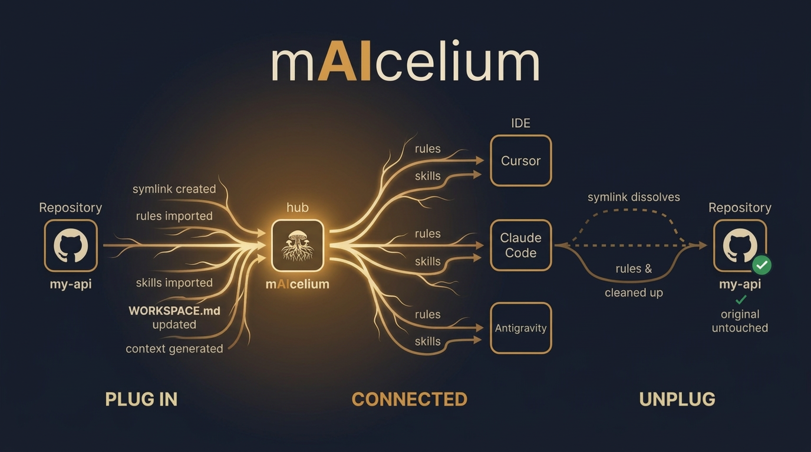

# Getting Started

This guide walks you through setting up a mAIcelium workspace from scratch and using it day-to-day. Each step includes the exact commands to run and an explanation of what happens behind the scenes.

<p align="center">
  
</p>

## Prerequisites

- **Bash** (Linux/macOS default shell)
- **Python 3** (used by scripts for YAML updates)
- **Git**
- At least one AI-powered IDE: [Cursor](https://cursor.sh), [Claude Code](https://docs.anthropic.com/en/docs/claude-code), or Antigravity

---

## Step 1: Clone the repository

```bash
git clone https://github.com/your-user/mAIcelium.git
cd mAIcelium
```

This gives you the workspace structure with all the scripts, rules, and skills already in place.

---

## Step 2: Initialize the workspace

```bash
bin/init.py
```

**What happens behind the scenes:**

1. Creates the full directory structure (`mesh/`, `projects/`, `repos/`, `.cursor/`, `.claude/`, `.antigravity/`).
2. Creates symlinks from `mesh/rules/` → `.cursor/rules/` (one per rule file).
3. Creates symlinks from `mesh/skills/` → `.cursor/skills-cursor/` (one per skill directory).
4. Creates directory symlinks for Antigravity: `.antigravity/rules` → `mesh/rules`, `.antigravity/skills` → `mesh/skills`.
5. Generates `.claude/settings.json` with safe default permissions.
6. Creates `WORKSPACE.md` if it doesn't exist.
7. Copies `repos/_registry.yaml.example` → `repos/_registry.yaml` if needed.

**Expected output:**

```
🍄 Initializing mAIcelium at: /home/user/dev/mAIcelium
  → Creating Cursor symlinks...
  ✔ Cursor symlinks created
  → Creating Antigravity symlinks...
  ✔ Antigravity symlinks created
  ✔ .claude/settings.json created
  ✔ WORKSPACE.md created
  ✔ Script permissions set

✅ mAIcelium initialized successfully.
   Next step: open this directory in your IDEs
```

---

## Step 3: Register your repositories

Edit `repos/_registry.yaml` to list all the repos you work with. This registry helps agents discover available projects before plugging them in.

```bash
# The init script already copied the template
# Just edit it with your repos:
nano repos/_registry.yaml
```

**Example:**

```yaml
clients:
  acme-corp:
    description: "Acme Corp project"
    repos:
      api:
        path: ~/dev/acme-api
        tech: [python, fastapi, postgres]
      frontend:
        path: ~/dev/acme-frontend
        tech: [react, typescript, tailwind]

personal:
  my-blog:
    path: ~/dev/my-blog
    tech: [astro, markdown]
  dotfiles:
    path: ~/dotfiles
    tech: [bash, zsh]

development:
  tools:
    path: ~/dev/tools
    tech: [python, bash]
```

> **Note:** This file is `.gitignored` because it contains user-specific local paths. Each person maintains their own copy.

---

## Step 4: Open the workspace in your IDEs

Open the `mAIcelium/` directory in your IDE(s) of choice. Each IDE will automatically discover its configuration:

- **Cursor** reads `.cursor/rules/` and `.cursor/skills-cursor/`.
- **Claude Code** reads `CLAUDE.md` at the root.
- **Antigravity** reads `.antigravity/rules` and `.antigravity/skills`.

You can open the workspace in multiple IDEs simultaneously — that's the whole point. Each one has a defined role:

| IDE | You use it for |
|-----|---------------|
| Cursor | Writing and implementing code |
| Claude Code | Planning features, analyzing architecture, reviewing designs |
| Antigravity | Refactoring, code review, scoped tasks |

---

## Step 5: Plug in a project

When you want to work on a specific project, plug it into the workspace.

**From the terminal:**

```bash
bin/add_project.py my-api ~/dev/acme-api
```

**From inside an IDE (with fuzzy matching):**

Use the slash command `/add_project`. You only need to type an approximate name — the system matches it against `repos/_registry.yaml`:

```
/add_project acme       → exact match if "acme" exists
/add_project ac         → fuzzy match, may ask to disambiguate
```

If the input is ambiguous, the agent will show candidates and ask you to pick one.

**What happens behind the scenes:**

1. Creates a symlink: `projects/my-api` → `~/dev/acme-api`
2. If the project has `.cursor/rules/`, each rule is symlinked to `.cursor/rules/my-api--<rule-name>`
3. If the project has `.cursor/skills/`, each skill directory is symlinked to `.cursor/skills-cursor/my-api--<skill-name>`
4. Updates `WORKSPACE.md` with the project name, path, and timestamp
5. Regenerates `.claude/projects-context.md` so Claude Code knows about the project's rules and skills

**Expected output:**

```
✔ Project 'my-api' added → /home/user/dev/acme-api
  → Importing project rules...
    + my-api--eslint-rules.mdc
    + my-api--api-conventions.mdc
  ✔ Project rules imported
  → Importing project skills...
    + my-api--database-migrations
  ✔ Project skills imported
  ✔ WORKSPACE.md updated
  ✔ Claude project context updated

Active projects:
lrwxrwxrwx 1 user user  26 Mar 28 10:00 my-api -> /home/user/dev/acme-api
```

Now all three IDEs can see the project and its specific rules.

---

## Step 6: Work inside the project

Once a project is plugged in, all agent work happens inside `projects/<project-name>/`. The agents know this from the rules in `mesh/rules/global.md`.

**Example workflow in Cursor:**

1. Open any file under `projects/my-api/`.
2. The agent automatically applies global rules (coding standards, security checklist) plus any project-specific rules (`my-api--eslint-rules.mdc`).
3. When the agent needs a capability (e.g., code review), it reads the relevant skill from `mesh/skills/`.
4. Commits follow the conventions in `mesh/rules/commit-conventions.md`.

**Example workflow in Claude Code:**

1. Claude reads `CLAUDE.md` → knows to check `WORKSPACE.md` for active projects.
2. Reads `.claude/projects-context.md` → discovers the project's rules and skills.
3. Plans features, reviews architecture, or analyzes code — all scoped to the active project.

---

## Step 7: Unplug a project

When you're done working on a project:

```bash
bin/remove_project.py my-api
```

**What happens behind the scenes:**

1. Removes all `.cursor/rules/my-api--*` symlinks
2. Removes all `.cursor/skills-cursor/my-api--*` symlinks
3. Removes the `projects/my-api` symlink (the original repo is **never touched**)
4. Updates `WORKSPACE.md` to remove the entry
5. Regenerates `.claude/projects-context.md`

**Expected output:**

```
  - my-api--eslint-rules.mdc
  - my-api--api-conventions.mdc
  ✔ 2 project rule(s) removed
  - my-api--database-migrations
  ✔ 1 project skill(s) removed
✔ Project 'my-api' removed from workspace (original repo untouched)
  ✔ WORKSPACE.md updated
  ✔ Claude project context updated
```

---

## Step 8: Sync when needed

If you've added new rules or skills to `mesh/`, or if symlinks got broken (e.g., after moving the workspace directory), rebuild everything:

```bash
bin/sync_symlinks.py
```

This script:

1. Removes broken symlinks in `.cursor/rules/` and `.cursor/skills-cursor/`
2. Recreates all global rule and skill symlinks from `mesh/`
3. Re-imports rules and skills from all currently plugged-in projects
4. Recreates Antigravity directory symlinks
5. Regenerates `.claude/projects-context.md`
6. Ensures `CLAUDE.md` references `projects-context.md` (idempotent)

---

## Common scenarios

### Adding a new global rule

1. Create a markdown file in `mesh/rules/`, e.g., `mesh/rules/testing-standards.md`
2. Run `bin/sync_symlinks.py` to distribute it to all IDEs
3. All agents now follow the new rule

### Adding a new skill

1. Create a directory in the appropriate category, e.g., `mesh/skills/_domains/go/`
2. Add a `SKILL.md` with instructions for the agent
3. Run `bin/sync_symlinks.py`
4. Agents can now use the skill when working on relevant tasks

### Working on multiple projects simultaneously

You can plug in multiple projects at once:

```bash
bin/add_project.py api ~/dev/acme-api
bin/add_project.py frontend ~/dev/acme-frontend
```

Each project's rules and skills are imported with their own prefix, so there are no conflicts. Agents are instructed to ask which project to focus on if it's ambiguous.

### Moving to a new machine

1. Clone the mAIcelium repo
2. Run `bin/init.py`
3. Create your `repos/_registry.yaml` with local paths
4. Plug in the projects you need

The workspace is designed to be portable — only the `.gitignored` files contain machine-specific paths.

### Separating `.git` from the workspace (optional)

When multiple projects are linked, the workspace `.git` can conflict with the linked projects' own git contexts. To avoid this:

```bash
bin/separate_git.py
```

This moves `.git` to a sibling directory (`mAIcelium-git-backup/`) and creates a shell alias (`maicelium-git`) so you can still run git operations:

```bash
# Add to your shell profile (.bashrc / .zshrc)
source ~/dev/mAIcelium/bin/.git-alias.sh

# Then use it
maicelium-git status
maicelium-git add -A && maicelium-git commit -m "update skills"
maicelium-git push
```

Alternatively, use `/git_backup` from within the IDE to stage, commit, and push in one step.

---

Next: [Architecture](architecture.md) for a deep dive into how the system works, or [Reference](reference.md) for a quick lookup of all scripts and commands.
